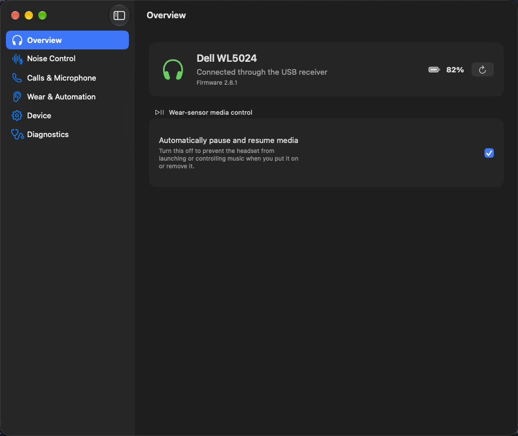
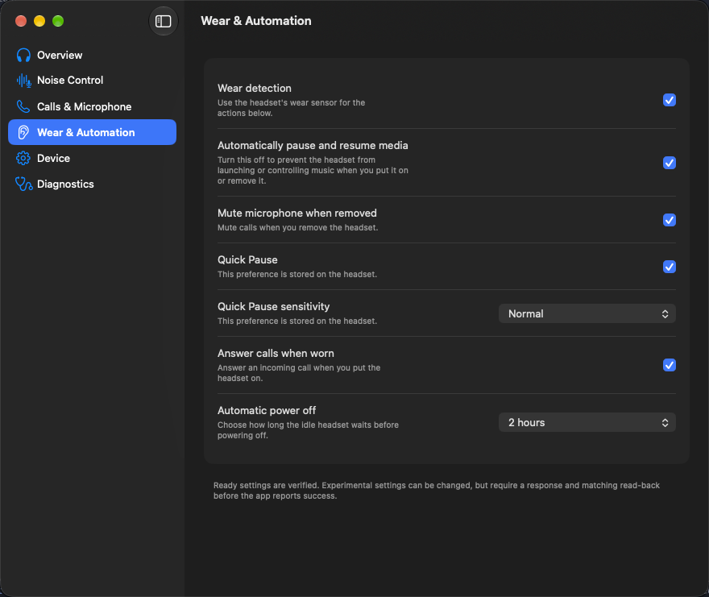
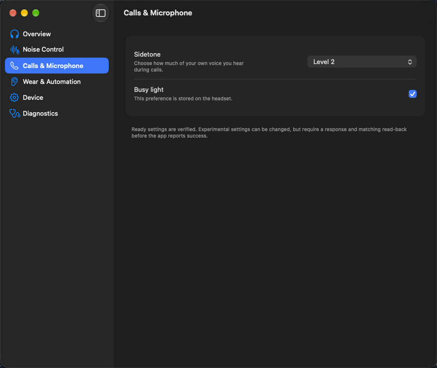

# WL5024 Control

A native Mac app for the **Dell Premier Wireless ANC Headset WL5024**. Adjust wear detection, stop the headset from automatically controlling your music, and manage supported microphone and call settings from a settings window or the menu bar.

**Requires macOS 26 or newer and an Apple silicon Mac.** This is an independent community project, not an official Dell app or a complete replacement for Dell's software.

[Download a release](https://github.com/zachspartofaday/WL5024Control/releases) · [Report a bug](https://github.com/zachspartofaday/WL5024Control/issues) · [Build from source](Documentation/DEVELOPMENT.md)

## What you can do

| Feature | Available controls |
| --- | --- |
| Wear and automation | Wear detection, automatic media pause/resume, mute when removed, answer calls when worn, Quick Pause and its sensitivity |
| Calls and microphone | Sidetone (off or levels 0–5), busy light, microphone noise cancellation |
| Voice guidance | Turn headset voice guidance on or off |
| Menu bar | View connection state and toggle automatic media control once its current value is available |
| Headset status | Refresh settings and view firmware or battery information when available |
| Diagnostics | Inspect the connection, run read-only discovery, and export a local diagnostic log |
| Demo mode | Explore the interface without connecting a headset |

**Live setting changes are experimental.** The app labels them accordingly and reports success only after the headset acknowledges a change and returns the requested value. Settings are changed only when you choose a value; connecting or refreshing does not change your preferences.

Automatic power off, Environment Detection, Smart Switch, microphone-boom action, UC profile/status, and LE Audio feature mode are **read-only** where the headset responds. Availability depends on the headset and firmware.

## Screenshots

These screenshots show the actual app in **demo mode**, with simulated connection details and values. Live controls may be experimental, read-only, or unavailable.

### Headset overview



### Wear and automation



### Calls and microphone



## Install and connect

1. Download the release ZIP from [Releases](https://github.com/zachspartofaday/WL5024Control/releases), then double-click it to extract the app. If no release is listed yet, use the [source build instructions](Documentation/DEVELOPMENT.md).
2. Move **WL5024Control.app** to **Applications** and open it. Release builds are signed with Developer ID and notarized by Apple.
3. Pair and connect **Dell WL5024 Headset** in **System Settings → Bluetooth**.
4. Allow Bluetooth access when the app asks. Keep the headset powered on and nearby while the app connects.
5. Choose **Refresh** to read the available settings, then change only the settings you want to adjust.

The app uses Bluetooth for settings control. It can detect compatible Dell USB receivers, but settings control through a receiver or a USB cable is not supported in the app.

To try the interface without a headset, quit the app and run:

```sh
open -a WL5024Control --args --demo
```

Quit and reopen the app normally to return to your real headset.

## Current limitations

- Firmware updates and factory reset are not supported.
- Listening ANC mode/level, Advanced Transparency, incoming-audio noise cancellation, EQ, device naming, and touch/gesture customization are not available.
- A Mac audio connection does not always expose the Bluetooth control connection the app needs. Some settings may remain unavailable or time out.
- Intel Macs, macOS versions before 26, and other Dell headset models are not supported. The interface is currently English-only.

## Troubleshooting and feedback

**Bluetooth permission is off:** Open **System Settings → Privacy & Security → Bluetooth**, allow WL5024 Control, then return to the app and reconnect.

**The headset is connected for audio, but settings are unavailable:** Check that the headset is powered on and connected in macOS Bluetooth settings. Reconnect in the app and choose Refresh. A refresh may take about 40 seconds when the headset does not respond.

**A setting change fails:** Refresh and check its current value before trying again. The app will not claim that an unconfirmed change succeeded.

For a bug report, include your app version, macOS version, headset firmware if known, and the steps that reproduce the problem. **Diagnostic exports can contain device identifiers, serial numbers, and raw headset traffic. Review and redact them before sharing; do not attach an unreviewed capture to a public issue.** See the [diagnostic guide](Documentation/DEVELOPMENT.md#hardware-capture) for details.

For security concerns, follow the [security policy](SECURITY.md).

## Development

Built with SwiftUI, CoreBluetooth, and IOKit. Development requires Xcode 26 or newer. See the [developer guide](Documentation/DEVELOPMENT.md) for build and test commands, demo modes, the command-line probe, and hardware diagnostics.

[Contributing](CONTRIBUTING.md) · [Protocol research](Documentation/PROTOCOL.md) · [Accessibility verification](Documentation/ACCESSIBILITY.md)

## License

[MIT](LICENSE) © 2026 Zachary Skjaveland. Dell and its product names are trademarks of their respective owners; this project is not affiliated with or endorsed by Dell.
